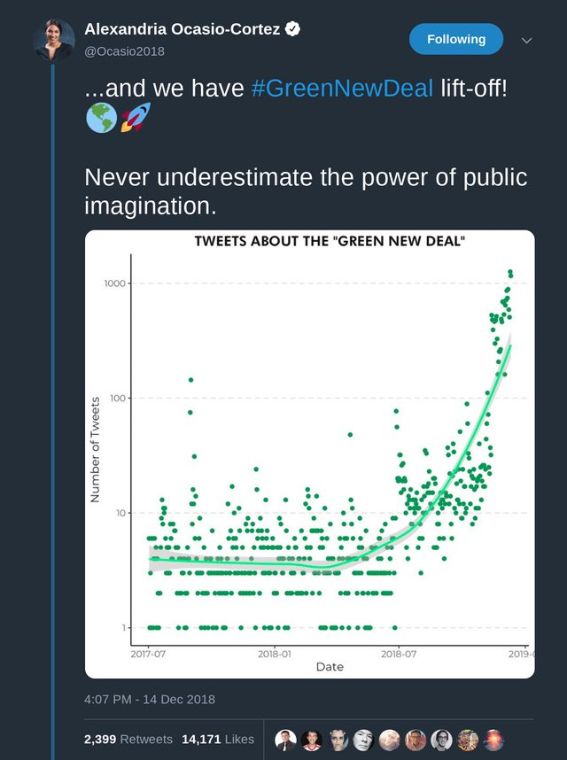

<!-- README.md is generated from README.Rmd. Please edit that file -->

```{r, include = FALSE}
knitr::opts_chunk$set(
  collapse = TRUE,
  comment = "#>",
  fig.path = "man/figures/README-",
  out.width = "100%"
)
```

# ggaoc: Alexandria Ocasio-Cortez inspired ggplots

The ggaoc package provides a theme, palette, and other useful functions to
customise ggplots and give them a Alexandria Ocasio-Cortez inspired look.

## Why

All begins with this tweet:




## How

To install the development version from GitHub:

```
# install.packages("pak")
pak::pak("jrosell/ggaoc")
```

## What

Here an example.

Before:

```{r}
library(gapminder)
library(ggplot2)

americas <- gapminder[gapminder$continent == "Americas",]

ggplot(americas) +
    geom_jitter(aes(year, lifeExp, colour = "Points")) +
    geom_smooth(aes(year, lifeExp, colour = "Trend")) +
    labs(  # Use insprired labels
      title = "Americas | Life Expectation by Year",
      x = "Year",
      y = "Age by Country"
    )
```


After:

```{r}
library(gapminder)
library(ggplot2)
library(ggaoc)

theme_set(theme_aoc()) # Set the theme

americas <- gapminder[gapminder$continent == "Americas",]

ggplot(americas) +
    geom_jitter(aes(year, lifeExp, colour = "Points")) +
    geom_smooth(aes(year, lifeExp, colour = "Trend")) +
    scale_color_aoc() + # Use insprired colors
    labs_aoc(  # Use insprired labels
      title = "Americas | Life Expectation by Year",
      x = "Year",
      y = "Age by Country"
    )
```
