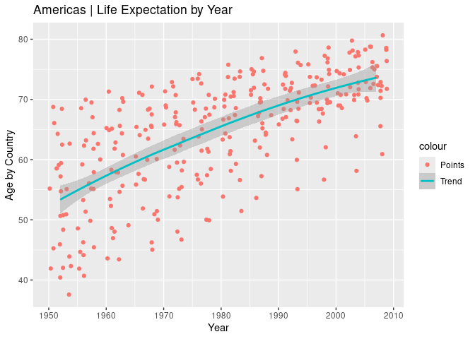

<!-- README.md is generated from README.Rmd. Please edit that file -->

# ggaoc: Alexandria Ocasio Cortez inspired ggplots

The ggaoc package provides a theme, palette, and other useful functions
to customise ggplots and give them a Alexandria Ocasio Cortez inspired
look.

## Why

All begins with this tweet:


## How

To install the development version from GitHub:

    # install.packages("pak")
    pak::pak("jrosell/ggaoc")

## What

Here an example.

Before:

``` r
library(gapminder)
library(ggplot2)

americas <- gapminder[gapminder$continent == "Americas",]

ggplot(americas) +
    geom_jitter(aes(year, lifeExp, colour = "Points")) +
    geom_smooth(aes(year, lifeExp, colour = "Trend")) +
    labs(  # Use insprired labels
      title = "Americas | Life Expectation by Year",
      x = "Year",
      y = "Age by Country"
    )
#> `geom_smooth()` using method
#> = 'loess' and formula = 'y ~
#> x'
```



After:

``` r
library(gapminder)
library(ggplot2)
library(ggaoc)

theme_set(theme_aoc()) # Set the theme
#> Loading required namespace: showtext
#> Loading required package: sysfonts
#> Loading required package: showtextdb

americas <- gapminder[gapminder$continent == "Americas",]

ggplot(americas) +
    geom_jitter(aes(year, lifeExp, colour = "Points")) +
    geom_smooth(aes(year, lifeExp, colour = "Trend")) +
    scale_color_aoc() + # Use insprired colors
    labs_aoc(  # Use insprired labels
      title = "Americas | Life Expectation by Year",
      x = "Year",
      y = "Age by Country"
    )
#> `geom_smooth()` using method
#> = 'loess' and formula = 'y ~
#> x'
```


